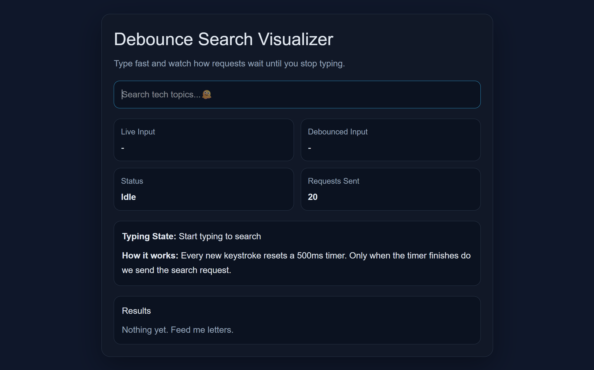
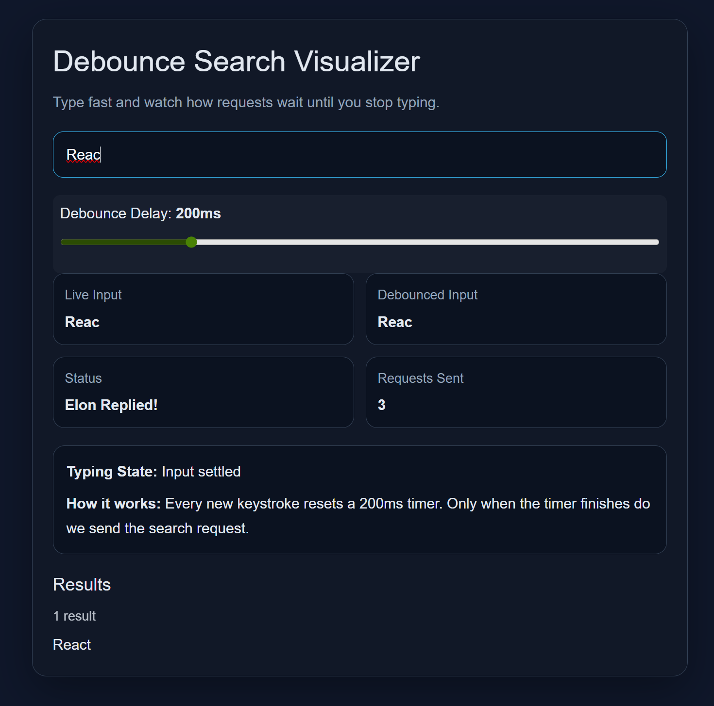

# Debounce Search Visualizer

## Preview




A small React project that demonstrates how **debouncing** works in search inputs.

This app helps visualize the difference between:

- the user's live input
- the debounced input
- the search request timing
- the number of requests sent

It is designed as a beginner-friendly project to learn a core frontend optimization concept used in real-world applications.

---

## Live Concept

When a user types in a search box, sending a request on **every keystroke** can be wasteful.

For example, typing:

`react`

could trigger 5 separate requests:

- `r`
- `re`
- `rea`
- `reac`
- `react`

With **debouncing**, the app waits for a short delay after the user stops typing, then sends only one request.

---

## What This Project Teaches

- React state management with `useState`
- Side effects with `useEffect`
- Cleanup functions in effects
- Debouncing with `setTimeout` and `clearTimeout`
- Simulating async API requests
- The difference between **live input** and **debounced input**
- Why debounce improves performance and user experience

---

## Features

- Search input with debounce behavior
- Adjustable debounce delay slider
- Live display of current debounce delay in milliseconds
- Separate display for live input and debounced input
- Request counter to visualize API calls
- Search status messages:
  - `Idle`
  - `Typing...`
  - `Waiting for debounce...`
  - `Contacting Elon Musk...`
  - `Elon Replied!`
- Fake search API with delay simulation
- Responsive dark UI
- Result count display
- Scrollable results area for longer result lists

---

## Tech Stack

- React
- Vite
- JavaScript
- CSS

---

## Project Structure

```bash
debounce-search-visualiser/
├── src/
│   ├── App.jsx
│   ├── main.jsx
│   └── index.css
├── public/
├── index.html
├── package.json
└── vite.config.js
```

## How It Works

The app uses two separate pieces of state:

- `query` → what the user is typing right now
- `debouncedQuery` → updates only after a delay

---

## Flow

1. User types in the input field
2. A timer starts
3. If the user types again before the timer ends, the old timer is cleared
4. Only the final timer completes
5. The debounced value updates
6. A search request is triggered

This prevents unnecessary repeated requests.

---

## Core Debounce Logic

```js
useEffect(() => {
  if (!query.trim()) {
    setDebouncedQuery("");
    setResults([]);
    setStatus("Idle");
    return;
  }

  setStatus("Waiting for debounce...");

  const timer = setTimeout(() => {
    setDebouncedQuery(query);
  }, delay);

  return () => {
    clearTimeout(timer);
  };
}, [query, delay]);
```

The cleanup function is what makes debouncing work properly.

---

## Why Debounce Matters

Without debounce:

- too many API calls
- wasted resources
- noisy UI updates
- poorer performance

With debounce:

- fewer requests
- cleaner UX
- better performance
- more realistic search behavior

---

## Debounce vs Throttle

| Concept  | Behavior                                 |
| -------- | ---------------------------------------- |
| Debounce | Waits until user stops triggering events |
| Throttle | Limits execution to once per interval    |

### Example

- Debounce → Search input
- Throttle → Scroll events

---

## Example

If debounce delay is set to 500ms:

- User types quickly → timer keeps resetting
- User pauses for 500ms → search runs once

If debounce delay is reduced to 200ms:

- app feels faster
- but sends more requests

If debounce delay is increased live using the slider:

- requests wait longer before firing
- users can directly observe how debounce timing affects behavior

This project helps visualize that tradeoff interactively.

---

## Getting Started

### 1. Clone the repository:

```bash
git clone https://github.com/Far-200/debounce-search-visualiser.git
```

### 2. Move into the project folder

```bash
cd debounce-search-visualiser
```

### 3. Install dependencies

```bash
npm install
```

### 4. Run the development server

```bash
npm run dev
```

---

## Learning Notes

This project is intentionally small, but it teaches an important real-world concept often asked in interviews:

- What is debounce?
- How is debounce different from throttle?
- Why do we clear timers in `useEffect` cleanup?

---

## Possible Improvements

- Extract debounce logic into a reusable useDebounce() hook
- Add a real API instead of fake local data
- Add loading spinner animation
- Add debounce delay controls
- Compare debounce vs throttle visually
- Add search history
- Add keyboard shortcuts

---

## Current Interactive Upgrade

This version also allows users to:

- change debounce delay live using a slider
- observe how delay affects request timing
- better understand the tradeoff between responsiveness and request frequency

---

## License

This project is built for learning and portfolio purposes.

---
